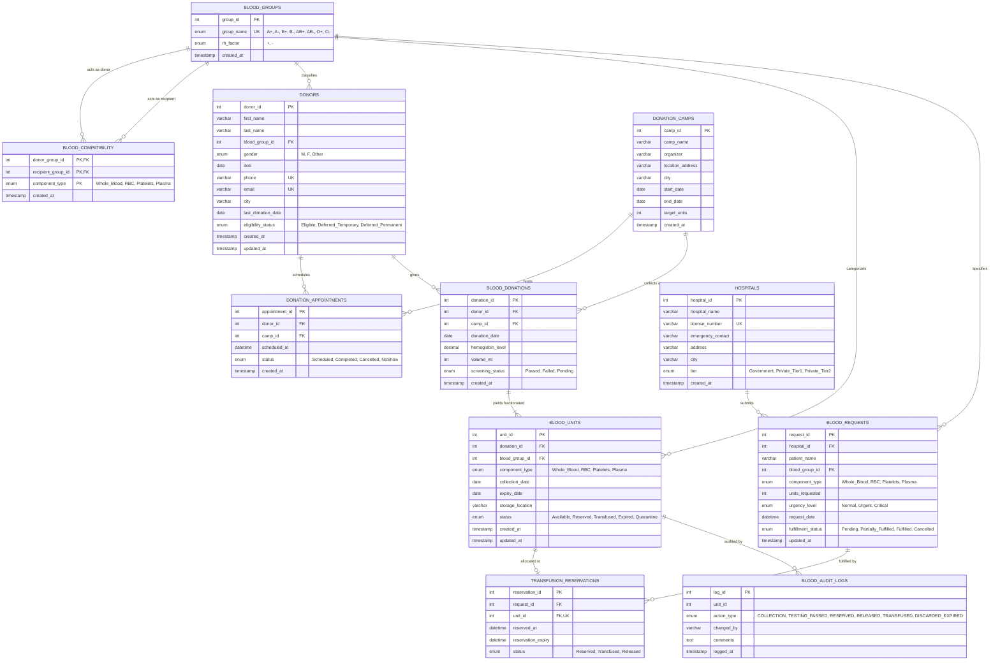

# Entity Relationship Diagram (ERD) & Data Dictionary

## Centralized Blood Bank & Emergency Donor Match Registry
**Target Engine:** MySQL 8.0+ / MariaDB 10.4+ (InnoDB Engine)  
**Normalization Standard:** Third Normal Form (3NF)  
**Character Set / Collation:** `utf8mb4` / `utf8mb4_unicode_ci`

---

## 1. Visual Entity Relationship Diagram (Mermaid.js)

The following Mermaid diagram maps all 11 entities with Crow's Foot cardinality notations, showing foreign key dependencies, associative entities, and relationship constraints.

---

## 2. Comprehensive Relational Data Dictionary

### Table 1: `blood_groups`
Lookup dimension defining the 8 human ABO/Rh phenotypes.
| Column | Type | Nullable | Key | Constraints / Default | Description |
|---|---|---|---|---|---|
| `group_id` | `INT` | NO | PK | `AUTO_INCREMENT` | Unique identifier for blood group |
| `group_name` | `ENUM` | NO | UK | `'A+','A-','B+','B-','AB+','AB-','O+','O-'` | Official clinical antigen nomenclature |
| `rh_factor` | `ENUM` | NO | - | `'+','-'` | Rhesus D-antigen surface protein presence |
| `created_at` | `TIMESTAMP`| NO | - | `CURRENT_TIMESTAMP` | System record creation timestamp |

---

### Table 2: `blood_compatibility`
M:N recursive bridge table modeling clinical cross-match rules across all 4 blood fractions.
| Column | Type | Nullable | Key | Constraints / Default | Description |
|---|---|---|---|---|---|
| `donor_group_id` | `INT` | NO | PK, FK | Ref `blood_groups(group_id)` | Source donor blood group |
| `recipient_group_id`| `INT` | NO | PK, FK | Ref `blood_groups(group_id)` | Target recipient blood group |
| `component_type` | `ENUM` | NO | PK | `'Whole_Blood','RBC','Platelets','Plasma'` | Specific blood biological fraction |
| `created_at` | `TIMESTAMP`| NO | - | `CURRENT_TIMESTAMP` | Matrix entry timestamp |

---

### Table 3: `donors`
Voluntary blood donor master demographic and clinical deferral registry.
| Column | Type | Nullable | Key | Constraints / Default | Description |
|---|---|---|---|---|---|
| `donor_id` | `INT` | NO | PK | `AUTO_INCREMENT` | Unique donor registration identifier |
| `first_name` | `VARCHAR(50)` | NO | - | - | Donor given name |
| `last_name` | `VARCHAR(50)` | NO | - | - | Donor surname |
| `blood_group_id` | `INT` | NO | FK | Ref `blood_groups(group_id)` | Verified ABO/Rh blood phenotype |
| `gender` | `ENUM` | NO | - | `'M','F','Other'` | Clinical biological sex |
| `dob` | `DATE` | NO | - | `CHECK (dob >= '1900-01-01')` | Date of birth for age validation |
| `phone` | `VARCHAR(20)` | NO | UK | Unique format | Primary mobile contact number |
| `email` | `VARCHAR(100)`| NO | UK | Valid email syntax | Digital correspondence address |
| `city` | `VARCHAR(50)` | NO | - | Indexed | Residential city for dispatch |
| `last_donation_date`| `DATE` | YES | - | NULL if never donated | Date of most recent phlebotomy |
| `eligibility_status`| `ENUM` | NO | - | `'Eligible','Deferred_Temporary','Deferred_Permanent'` | Clinical clearance state |
| `created_at` | `TIMESTAMP`| NO | - | `CURRENT_TIMESTAMP` | Account registration timestamp |
| `updated_at` | `TIMESTAMP`| NO | - | `ON UPDATE CURRENT_TIMESTAMP` | Last profile update timestamp |

---

### Table 4: `donation_camps`
Public and corporate mobile donation drives and regional collection hubs.
| Column | Type | Nullable | Key | Constraints / Default | Description |
|---|---|---|---|---|---|
| `camp_id` | `INT` | NO | PK | `AUTO_INCREMENT` | Unique camp campaign identifier |
| `camp_name` | `VARCHAR(100)`| NO | - | - | Public campaign banner name |
| `organizer` | `VARCHAR(100)`| NO | - | - | Sponsoring hospital or NGO |
| `location_address` | `VARCHAR(255)`| NO | - | - | Physical street address |
| `city` | `VARCHAR(50)` | NO | - | Indexed | Metropolitan host city |
| `start_date` | `DATE` | NO | - | - | Drive commencement date |
| `end_date` | `DATE` | NO | - | `CHECK (end_date >= start_date)` | Drive conclusion date |
| `target_units` | `INT` | NO | - | `DEFAULT 50, CHECK > 0` | Forecasted volume collection quota |
| `created_at` | `TIMESTAMP`| NO | - | `CURRENT_TIMESTAMP` | Record creation timestamp |

---

### Table 5: `donation_appointments`
Donor scheduling coordination for center or camp walk-ins.
| Column | Type | Nullable | Key | Constraints / Default | Description |
|---|---|---|---|---|---|
| `appointment_id` | `INT` | NO | PK | `AUTO_INCREMENT` | Unique booking token |
| `donor_id` | `INT` | NO | FK | Ref `donors(donor_id)` ON DELETE CASCADE | Registered donor identifier |
| `camp_id` | `INT` | YES | FK | Ref `donation_camps(camp_id)` ON DELETE SET NULL | Target drive (NULL = center) |
| `scheduled_at` | `DATETIME` | NO | - | - | Scheduled clinical phlebotomy slot |
| `status` | `ENUM` | NO | - | `'Scheduled','Completed','Cancelled','NoShow'` | Appointment operational status |
| `created_at` | `TIMESTAMP`| NO | - | `CURRENT_TIMESTAMP` | Reservation booking timestamp |

---

### Table 6: `blood_donations`
Clinical records of physical blood collection events.
| Column | Type | Nullable | Key | Constraints / Default | Description |
|---|---|---|---|---|---|
| `donation_id` | `INT` | NO | PK | `AUTO_INCREMENT` | Unique phlebotomy session ID |
| `donor_id` | `INT` | NO | FK | Ref `donors(donor_id)` ON DELETE RESTRICT | Donating patient identifier |
| `camp_id` | `INT` | YES | FK | Ref `donation_camps(camp_id)` ON DELETE SET NULL | Collection drive location |
| `donation_date` | `DATE` | NO | - | - | Date phlebotomy was performed |
| `hemoglobin_level` | `DECIMAL(3,1)`| NO | - | `CHECK >= 12.0` | Pre-donation fingerstick Hb (g/dL) |
| `volume_ml` | `INT` | NO | - | `CHECK >= 350` | Net collected blood volume |
| `screening_status` | `ENUM` | NO | - | `'Passed','Failed','Pending'` | Serology lab infectious disease screening |
| `created_at` | `TIMESTAMP`| NO | - | `CURRENT_TIMESTAMP` | Lab entry insertion timestamp |

---

### Table 7: `blood_units`
Individual fractionated blood products stored in physical inventory.
| Column | Type | Nullable | Key | Constraints / Default | Description |
|---|---|---|---|---|---|
| `unit_id` | `INT` | NO | PK | `AUTO_INCREMENT` | Unique inventory barcode |
| `donation_id` | `INT` | NO | FK | Ref `blood_donations(donation_id)` | Source collection donation |
| `blood_group_id` | `INT` | NO | FK | Ref `blood_groups(group_id)` | Fraction ABO/Rh phenotype |
| `component_type` | `ENUM` | NO | - | `'Whole_Blood','RBC','Platelets','Plasma'` | Fractionated physical component |
| `collection_date`| `DATE` | NO | - | - | Date of phlebotomy |
| `expiry_date` | `DATE` | NO | - | `CHECK (expiry_date >= collection_date)` | Shelf-life calculated date |
| `storage_location`| `VARCHAR(50)` | NO | - | - | Physical cold room, agitator, freezer |
| `status` | `ENUM` | NO | - | `'Available','Reserved','Transfused','Expired','Quarantine'` | Inventory lifecycle state |
| `created_at` | `TIMESTAMP`| NO | - | `CURRENT_TIMESTAMP` | Initial database entry |
| `updated_at` | `TIMESTAMP`| NO | - | `ON UPDATE CURRENT_TIMESTAMP` | Last status modification |

---

### Table 8: `hospitals`
Accredited healthcare institutions and clinical blood purchasers.
| Column | Type | Nullable | Key | Constraints / Default | Description |
|---|---|---|---|---|---|
| `hospital_id` | `INT` | NO | PK | `AUTO_INCREMENT` | Institutional primary key |
| `hospital_name` | `VARCHAR(100)`| NO | - | - | Legal entity healthcare facility name |
| `license_number`| `VARCHAR(50)` | NO | UK | Unique regulatory ID | State healthcare commission license |
| `emergency_contact`| `VARCHAR(20)`| NO | - | - | 24/7 Transfusion blood bank desk |
| `address` | `VARCHAR(255)`| NO | - | - | Physical emergency dispatch address |
| `city` | `VARCHAR(50)` | NO | - | Indexed | Metropolitan municipality |
| `tier` | `ENUM` | NO | - | `'Government','Private_Tier1','Private_Tier2'` | Priority and facility tiering |
| `created_at` | `TIMESTAMP`| NO | - | `CURRENT_TIMESTAMP` | Facility onboarding timestamp |

---

### Table 9: `blood_requests`
Clinical requisitions placed by hospitals for acute or elective transfusions.
| Column | Type | Nullable | Key | Constraints / Default | Description |
|---|---|---|---|---|---|
| `request_id` | `INT` | NO | PK | `AUTO_INCREMENT` | Order tracking requisition token |
| `hospital_id` | `INT` | NO | FK | Ref `hospitals(hospital_id)` | Ordering medical facility |
| `patient_name` | `VARCHAR(100)`| NO | - | - | Anonymized patient / ward reference |
| `blood_group_id` | `INT` | NO | FK | Ref `blood_groups(group_id)` | Patient confirmed ABO/Rh group |
| `component_type` | `ENUM` | NO | - | `'Whole_Blood','RBC','Platelets','Plasma'` | Required blood component fraction |
| `units_requested`| `INT` | NO | - | `CHECK > 0` | Quantity of units requisitioned |
| `urgency_level` | `ENUM` | NO | - | `'Normal','Urgent','Critical'` | Clinical triage priority tier |
| `request_date` | `DATETIME` | NO | - | `DEFAULT CURRENT_TIMESTAMP` | Requisition placement time |
| `fulfillment_status`| `ENUM` | NO | - | `'Pending','Partially_Fulfilled','Fulfilled','Cancelled'` | Aggregate order fulfillment |
| `updated_at` | `TIMESTAMP`| NO | - | `ON UPDATE CURRENT_TIMESTAMP` | Timestamp of state transition |

---

### Table 10: `transfusion_reservations`
Pessimistic allocation bridge binding a specific physical unit to a hospital requisition.
| Column | Type | Nullable | Key | Constraints / Default | Description |
|---|---|---|---|---|---|
| `reservation_id` | `INT` | NO | PK | `AUTO_INCREMENT` | Unique reservation allocation token |
| `request_id` | `INT` | NO | FK | Ref `blood_requests(request_id)` | Requisition order reference |
| `unit_id` | `INT` | NO | FK, UK | Ref `blood_units(unit_id)` | Unique barcode of reserved unit |
| `reserved_at` | `DATETIME` | NO | - | `DEFAULT CURRENT_TIMESTAMP` | Locking timestamp |
| `reservation_expiry`| `DATETIME` | NO | - | Usually `NOW() + 2 HOURS` | Expiration of lock window |
| `status` | `ENUM` | NO | - | `'Reserved','Transfused','Released'` | Final disposition of reservation |

---

### Table 11: `blood_audit_logs`
Immutable append-only regulatory compliance ledger tracking biological chain of custody.
| Column | Type | Nullable | Key | Constraints / Default | Description |
|---|---|---|---|---|---|
| `log_id` | `INT` | NO | PK | `AUTO_INCREMENT` | Monotonically increasing event ID |
| `unit_id` | `INT` | NO | - | Indexed | Target blood unit identifier |
| `action_type` | `ENUM` | NO | - | `'COLLECTION','TESTING_PASSED','RESERVED','RELEASED','TRANSFUSED','DISCARDED_EXPIRED'` | Event lifecycle action classification |
| `changed_by` | `VARCHAR(100)`| NO | - | - | DB user or application actor |
| `comments` | `TEXT` | YES | - | - | Diagnostic event context or audit note |
| `logged_at` | `TIMESTAMP`| NO | - | `CURRENT_TIMESTAMP` | Immutable event timestamp |

---

## 3. Third Normal Form (3NF) Normalization Proof

To satisfy university DBMS grading criteria, the schema eliminates all insertion, update, and deletion anomalies through formal normalization:

1. **First Normal Form (1NF):**
   - All attributes are atomic (no multivalued groups; patient name, address, contact numbers separated).
   - Each table has an explicit Primary Key (`INT AUTO_INCREMENT` or composite key).
2. **Second Normal Form (2NF):**
   - All 1NF requirements are met.
   - Zero Partial Dependencies: In associative tables with composite primary keys (`blood_compatibility`), every non-key column (`created_at`) depends on the entire composite key `(donor_group_id, recipient_group_id, component_type)`.
3. **Third Normal Form (3NF):**
   - All 2NF requirements are met.
   - Zero Transitive Dependencies: Non-key attributes depend **only** on the primary key, and nothing else ($X \rightarrow Y$ where $X$ is a superkey).
     - *Example:* Hospital address and city are stored in `hospitals`, not duplicated in `blood_requests`.
     - *Example:* Blood group properties (`rh_factor`) reside exclusively in `blood_groups` and are referenced via foreign key (`blood_group_id`).
